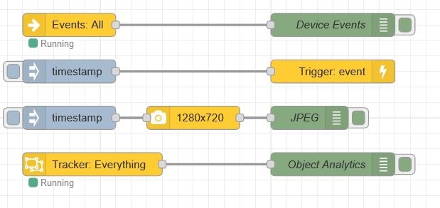

# node-red-contrib-axis-host
Nodes that provides bindings to Axis device resources when running [Node-RED on an Axis Device](https://pandosme.github.io/acap/node-red/2020/01/01/nodered-acap.html).  They provide no value when installed on any other host.

### Events
Revice all or selected events detected in the Axis device.

### Camera
Capture a JPEG image from the Axis camera with user defined resolutions.  It is also possible to get a cropped part of the image.

### Trigger
Generate an event in the Axis device that can be used to trigger an action in the device or a VMS (Video Management System).  Three events are avaialbel. Event (value), State (true/false), and Data (Arbitrary string e.g. JSON)

### Objects
Analytics data of objects detected by the camera including bounding box and classification.  The output can be configured to recive detections, tracker, or paths.

## History
1.0.1  Initial version
